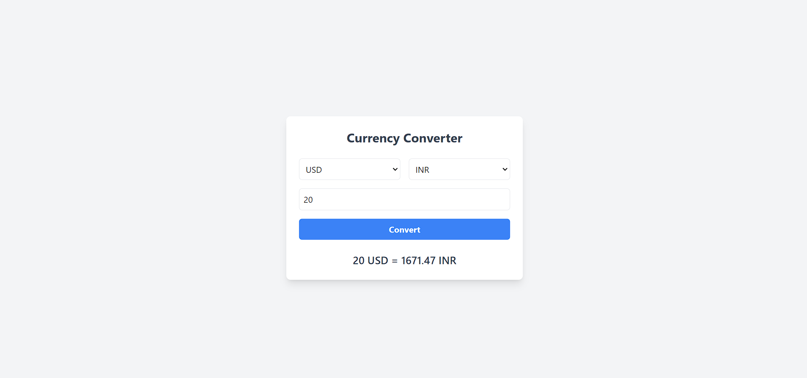

# Currency Converter App

This is a simple currency converter app built with **Next.js** and **Tailwind CSS**. The app allows users to select two currencies, input an amount, and convert it based on real-time exchange rates fetched from an API.

## Features

- Convert currencies in real-time.
- Select two currencies from a dropdown list.
- Clean and responsive UI built with Tailwind CSS.

## Screenshot



*Replace the above link with an actual screenshot of the app once you have one.*

## Prerequisites

- **Node.js** (v14 or higher)
- **npm** or **yarn**

## Getting Started

### 1. Clone the repository

```bash
git clone https://github.com/SAFVAN-C-M-C/Currency-Converter-.git
```

### 2. Navigate to the project directory

```bash
cd currency-converter-app
```

### 3. Install dependencies

Using **npm**:

```bash
npm install
```

Or using **yarn**:

```bash
yarn install
```

### 4. Set up environment variables

1. Create a `.env.local` file in the root directory of the project.

2. Add the following environment variable to the `.env.local` file:

```bash
NEXT_PUBLIC_EXCHANGE_RATE_API_KEY=your_api_key_here
```

- Replace `your_api_key_here` with your actual API key from [ExchangeRate-API](https://www.exchangerate-api.com/).

### 5. Run the app

Using **npm**:

```bash
npm run dev
```

Or using **yarn**:

```bash
yarn dev
```

The app will be running on [http://localhost:3000](http://localhost:3000).

### 6. Building the app for production

To build the app for production:

Using **npm**:

```bash
npm run build
```

Or using **yarn**:

```bash
yarn build
```

Then, to start the production server:

Using **npm**:

```bash
npm run start
```

Or using **yarn**:

```bash
yarn start
```

### 7. How to Use

- Select the currency you want to convert **from** and **to**.
- Enter the amount you want to convert.
- Click the **Convert** button to see the result.

## Technologies Used

- **Next.js**: A React-based framework for building web applications.
- **Tailwind CSS**: A utility-first CSS framework for rapidly building custom designs.
- **ExchangeRate-API**: A free API for fetching real-time exchange rates.

